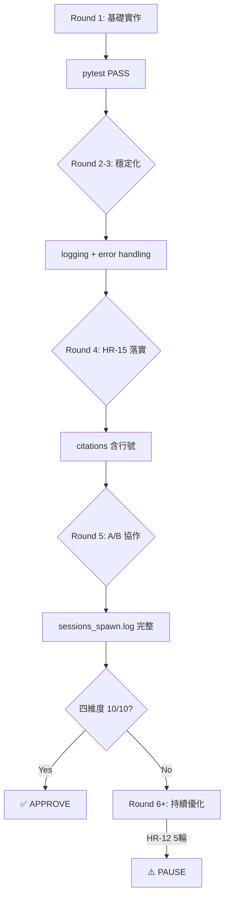

# Phase 3 執行計劃 — tts-kokoro-v613

> **版本**: 7.20
> **專案**: tts-kokoro-v613
> **日期**: 2026-04-11
> **Framework**: methodology-v2 7.20
> **狀態**: 待 Johnny 確認啟動

---

## 0. 執行協議（§0）

```
[Step 0] READ state.json → current_phase=3
[Step 1] LOAD SKILL.md §4 Phase 路由
[Step 2] CHECK 進入條件 → blocker → STOP
[Step 3] EXECUTE SOP → LAZY LOAD docs/P3_SOP.md
[Step 4] RECORD output | SPAWN A/B agent
[Step 5] CHECK 退出條件 → fail → FIX + RETRY
[Step 6] UPDATE state.json phase=4 → GOTO 1
```

**CLI 命令**：
```bash
python3 cli.py update-step --step N
python3 cli.py end-phase --phase 3
python3 cli.py stage-pass --phase 3
python3 cli.py run-phase --phase 3 --goal "Phase 3 execution"
```

---

## 1. 硬規則（HR-01~HR-15）

| HR | 規則 | 後果 | 具體行動 |
|----|------|------|---------|
| HR-01 | A/B 不同 Agent，禁自寫自審 | 終止 -25 | Developer spawn → Reviewer spawn（嚴格順序）|
| HR-02 | Quality Gate 需實際命令輸出 | 終止 -20 | 每個 QG 保存 stdout |
| HR-03 | Phase 順序執行，不可跳過 | 終止 -30 | state.json phase=3 |
| HR-04 | HybridWorkflow mode=ON，強制 A/B | 終止 | prompt 含 mode=ON |
| HR-05 | 衝突時優先 methodology-v2 | 記錄 | 爭議時 methodology-v2 為準 |
| HR-06 | 禁引入規格書外框架 | 終止 -20 | forbidden list |
| HR-07 | DEVELOPMENT_LOG 需記錄 session_id | -15 | 每筆記 session_id |
| HR-08 | Phase 結束需執行 Quality Gate | 終止 -10 | stage-pass --phase 3 |
| HR-09 | Claims Verifier 驗證需通過 | 終止 -20 | citations 對照 |
| HR-10 | sessions_spawn.log 需有 A/B 記錄 | 終止 -15 | 每 step 2 筆記錄 |
| HR-11 | Phase Truth < 70% 禁進入下一 Phase | 終止 | <70% → PAUSE |
| HR-12 | A/B 審查 > 5 輪 → PAUSE | — | 達 5 輪主動停 |
| HR-13 | Phase 執行 > 預估 ×3 → PAUSE | — | 記 start_time |
| HR-14 | Integrity < 40 → FREEZE | — | QG 後查 Integrity |
| HR-15 | citations 必須含行號 + artifact_verification | -15 | 無 citations = 任務失敗 |

---

## 2. A/B 協作（HR-01, HR-04）

### On Demand / Need to Know 原則

| 原則 | 定義 |
|------|------|
| **Need to Know** | 只給必要資訊，L1/NFR 被問時才提供 |
| **On Demand** | Sub-agent 自己讀 artifact paths，不 dump |
| **職責單一** | 每個 Sub-agent 只做一個 FR |

### HR 約束（Phase 3）
HR-01 | HR-04 | HR-06 | HR-07 | HR-08 | HR-10 | HR-11 | HR-15

### TH 閾值（Phase 3）
TH-06 | TH-08 | TH-09 | TH-10 | TH-11 | TH-15 | TH-16

### A/B 角色（Phase 3）

| 角色 | Agent | 職責 |
|------|-------|------|
| **Agent A** | `developer` | 主要實作 |
| **Agent B** | `reviewer` | 審查驗證 |

### TH 閾值詳細

| TH | 指標 | 門檻 | 驗證命令 |
|------|------|------|---------|
| TH-06 | Constitution 測試覆蓋率 | >80% | `constitution/runner.py --type implementation` |
| TH-08 | AgentEvaluator 嚴格 | ≥90 | `phase-verify` |
| TH-10 | 測試通過率 | =100% | `pytest tests/ -v` |
| TH-11 | 單元測試覆蓋率 | ≥70% | `pytest --cov=app/ -v` |
| TH-15 | Phase Truth | ≥70% | `phase-verify` |
| TH-16 | 代碼↔SAD 映射率 | =100% | `trace-check` |

---

## 3. FR-by-FR 任務表格（共 9 項）

| FR | 模組 | 產出檔案 | 測試檔案 | 驗證命令 |
|------|------|---------|----------|---------|
| FR-01 | — | `` | `tests/test_fr01.py` | `pytest tests/test_fr01*.py -v` |
| FR-02 | — | `` | `tests/test_fr02.py` | `pytest tests/test_fr02*.py -v` |
| FR-03 | — | `` | `tests/test_fr03.py` | `pytest tests/test_fr03*.py -v` |
| FR-04 | — | `` | `tests/test_fr04.py` | `pytest tests/test_fr04*.py -v` |
| FR-05 | — | `` | `tests/test_fr05.py` | `pytest tests/test_fr05*.py -v` |
| FR-06 | — | `` | `tests/test_fr06.py` | `pytest tests/test_fr06*.py -v` |
| FR-07 | — | `` | `tests/test_fr07.py` | `pytest tests/test_fr07*.py -v` |
| FR-08 | — | `` | `tests/test_fr08.py` | `pytest tests/test_fr08*.py -v` |
| FR-09 | — | `` | `tests/test_fr09.py` | `pytest tests/test_fr09*.py -v` |


---

## 3.5 上階段產出承接（Phase 3 前置產出）

> 上階段（Phase 2）產出摘要：

| 產出 | 狀態 | 路徑 |
|------|:-----:|------|
| ❌ 任務初始化 | ❌ | `TASK_INITIALIZATION_PROMPT.md` |
| ✅ 需求規格 | ✅ | `/Users/johnny/.openclaw/workspace/tts-kokoro-v613/SRS.md` (9 FR, 4 NFR) |

> ⚠️ 請在執行前確認上階段產出存在且完整。

---

## 4. 產出結構樹

```
*（請從 SAD.md §1.3 解析）*
```

> 📋 結構從 SAD.md §1.3 FR 需求對應表解析

### 交付物檢查清單

```markdown
## Phase 3 交付物

### 代碼產出
- [ ] `03-development/src/processing/` - 處理模組
- [ ] `03-development/src/synth/` - 合成模組
- [ ] `03-development/src/infrastructure/` - 基礎設施模組（如有）
- [ ] `03-development/src/api/` - API 路由（如有）

### 測試產出
- [ ] `tests/test_fr01*.py` - FR-01 測試
- [ ] `tests/test_fr02*.py` - FR-02 測試
- [ ] ...（共 9 個 FR）

### 文檔產出
- [ ] `AB_COLLABORATION.md` - Developer+Reviewer 協作記錄
- [ ] `sessions_spawn.log` - A/B session 完整記錄
- [ ] `docs/TOOL_HOOK_LOG.md` - 工具鉤子使用記錄（可選）
- [ ] `docs/OPTIMIZATION_REPORT.md` - 四維度評核報告（可選）

### 驗證產出
- [ ] pytest 所有測試 PASS
- [ ] coverage ≥80%
- [ ] Phase Truth ≥70%

### Git 產出
- [ ] git push 完成
- [ ] remote 同步驗證
```

---

## 5. FR 詳細任務（共 9 項）

> ⚠️ FR 詳細任務需要解析 SRS.md §FR-XX
> 完整內容見 `.methodology/plans/phase3_FULL.md`
> 若要生成詳細任務，加上 `--detailed` flag

### FR-01 Unknown

**任務**：實作 Unknown

**SRS §FR-01 要求**：
> 詳見 `.methodology/plans/phase3_FULL.md` 或執行 `python3 scripts/generate_full_plan.py --phase 3`

**SAD §Module 對應**：
- `Unknown` 類
- `N/A`

**Forbidden**：
- ❌ 03-development/src/infrastructure/
- ❌ @covers: L1 Error
- ❌ @type: edge

### FR-02 Unknown

**任務**：實作 Unknown

**SRS §FR-02 要求**：
> 詳見 `.methodology/plans/phase3_FULL.md` 或執行 `python3 scripts/generate_full_plan.py --phase 3`

**SAD §Module 對應**：
- `Unknown` 類
- `N/A`

**Forbidden**：
- ❌ 03-development/src/infrastructure/
- ❌ @covers: L1 Error
- ❌ @type: edge

### FR-03 Unknown

**任務**：實作 Unknown

**SRS §FR-03 要求**：
> 詳見 `.methodology/plans/phase3_FULL.md` 或執行 `python3 scripts/generate_full_plan.py --phase 3`

**SAD §Module 對應**：
- `Unknown` 類
- `N/A`

**Forbidden**：
- ❌ 03-development/src/infrastructure/
- ❌ @covers: L1 Error
- ❌ @type: edge

### FR-04 Unknown

**任務**：實作 Unknown

**SRS §FR-04 要求**：
> 詳見 `.methodology/plans/phase3_FULL.md` 或執行 `python3 scripts/generate_full_plan.py --phase 3`

**SAD §Module 對應**：
- `Unknown` 類
- `N/A`

**Forbidden**：
- ❌ 03-development/src/infrastructure/
- ❌ @covers: L1 Error
- ❌ @type: edge

### FR-05 Unknown

**任務**：實作 Unknown

**SRS §FR-05 要求**：
> 詳見 `.methodology/plans/phase3_FULL.md` 或執行 `python3 scripts/generate_full_plan.py --phase 3`

**SAD §Module 對應**：
- `Unknown` 類
- `N/A`

**Forbidden**：
- ❌ 03-development/src/infrastructure/
- ❌ @covers: L1 Error
- ❌ @type: edge

### FR-06 Unknown

**任務**：實作 Unknown

**SRS §FR-06 要求**：
> 詳見 `.methodology/plans/phase3_FULL.md` 或執行 `python3 scripts/generate_full_plan.py --phase 3`

**SAD §Module 對應**：
- `Unknown` 類
- `N/A`

**Forbidden**：
- ❌ 03-development/src/infrastructure/
- ❌ @covers: L1 Error
- ❌ @type: edge

### FR-07 Unknown

**任務**：實作 Unknown

**SRS §FR-07 要求**：
> 詳見 `.methodology/plans/phase3_FULL.md` 或執行 `python3 scripts/generate_full_plan.py --phase 3`

**SAD §Module 對應**：
- `Unknown` 類
- `N/A`

**Forbidden**：
- ❌ 03-development/src/infrastructure/
- ❌ @covers: L1 Error
- ❌ @type: edge

### FR-08 Unknown

**任務**：實作 Unknown

**SRS §FR-08 要求**：
> 詳見 `.methodology/plans/phase3_FULL.md` 或執行 `python3 scripts/generate_full_plan.py --phase 3`

**SAD §Module 對應**：
- `Unknown` 類
- `N/A`

**Forbidden**：
- ❌ 03-development/src/infrastructure/
- ❌ @covers: L1 Error
- ❌ @type: edge

### FR-09 Unknown

**任務**：實作 Unknown

**SRS §FR-09 要求**：
> 詳見 `.methodology/plans/phase3_FULL.md` 或執行 `python3 scripts/generate_full_plan.py --phase 3`

**SAD §Module 對應**：
- `Unknown` 類
- `N/A`

**Forbidden**：
- ❌ 03-development/src/infrastructure/
- ❌ @covers: L1 Error
- ❌ @type: edge


---

## 6. 外部文檔

| 文檔 | 用途 |
|------|------|
| `SKILL_DOMAIN.md` | 領域知識（TTS/SSML/台灣中文） |
| `docs/P3_SOP.md` | Phase 3 詳細步驟 |
| `templates/` | 交付物模板（.md） |
| `docs/HYBRID_WORKFLOW_GUIDE.md` | A/B 協作規範 |
| `docs/CLI_REFERENCE.md` | CLI 工具用法 |
| `docs/ANNOTATION_GUIDE.md` | @FR annotation 規範 |
| `docs/VERIFIER_GUIDE.md` | Reviewer 規範 |
| `docs/CONSTITUTION_GUIDE.md` | Constitution 規範 |

---

## 7. Developer Prompt 模板（On Demand）

### Agent A（Developer）

```
```
TASK: FR-01 台灣中文詞彙映射
TASK_ID: task-01
═══════════════════════════════════════


【先決條件】先執行：
cd /Users/johnny/.openclaw/workspace/tts-kokoro-v613
pwd  # 確認包含 "tts-kokoro-v613"

【階段目標】
依據 SAD 實作指定模組，包含單元測試

【On Demand 讀取】（只讀這些章節，❌ 禁止 dump 全文）

SRS.md 只讀取：
- §FR-01 需求描述
- §FR-01 測試案例（有的話）

SAD.md 只讀取：
- §Module 邊界對照表（對應 FR-01 的章節）

【產出】
- 03-development/src/processing/01.py}：實作代碼
- tests/test_01.py：單元測試

【驗證標準】
- pytest 100% 通過
- 覆蓋率 ≥70%
- docstring 包含 [FR-XX] 標記
- docstring 包含 Citations（SRS.md#L行號, SAD.md#L行號）

【FORBIDDEN】
- ❌ dump SRS.md/SAD.md 全文
- ❌ app/infrastructure/（已廢除，請用正確目錄）
- ❌ docstring 沒有 [FR-XX] 標記
- ❌ docstring 沒有 Citations（含行號）
- ❌ @type: edge
- ❌ ... 省略 → 任務失敗
- ❌ 無 citations 或 citations 無行號 → HR-15 違規
- ❌ citations 未寫入 code docstring → HR-15 違規

【OUTPUT_FORMAT】
{{
 "status": "success|error|unable_to_proceed",
 "result": "實際產出（路徑）",
 "confidence": 1-10,
 "citations": ["FR-01", "SRS.md#L23-L45", "SAD.md#L50-L60"],
 "summary": "50字內"
}}

HR-15 強制執行：citations 必須包含「檔名#L行號」格式，且需寫入 code docstring
═══════════════════════════════════════
```
```

### Agent B（Reviewer）

```
```
TASK: Review FR-01 台灣中文詞彙映射
TASK_ID: task-01-review
═══════════════════════════════════════


【先決條件】先執行：
cd /Users/johnny/.openclaw/workspace/tts-kokoro-v613
pwd  # 確認包含 "tts-kokoro-v613"

【審查範圍】（只讀這些章節，❌ 禁止 dump 全文）

待審查檔案：
- {fr.get('file', 'app/processing/01.py')}（每個函數的 docstring 需含 [FR-XX]）
- tests/test_01.py

規格參考：
- SRS.md §FR-01（只讀需求和測試案例章節）

【驗證檢查清單】
1. 每個公開函數的 docstring 含 [FR-XX] 標記
2. 每個公開函數的 docstring 含 Citations（SRS.md#L行號, SAD.md#L行號）
3. 測試覆蓋率 ≥70%
4. pytest 100% 通過
5. 無邏輯錯誤或安全漏洞
6. Constitution 代碼分數 ≥80%

【REJECT_IF】
- ❌ docstring 無 [FR-XX] 標記 → REJECT
- ❌ docstring 無 Citations（含行號）→ REJECT
- ❌ NFR 約束違背 → REJECT
- ❌ confidence < 6 → REJECT
- ❌ 缺少 citations 或 citations 無行號 → REJECT（HR-15）
- ❌ 覆蓋率 < 70% → REJECT

【OUTPUT_FORMAT】
{{
 "status": "APPROVE|REJECT",
 "confidence": 1-10,
 "violations": ["具體問題"],
 "coverage": "覆蓋率 %",
 "summary": "50字內"
}}
═══════════════════════════════════════
```
```

```
═══════════════════════════════════════
TASK: FR-{FR_NUM} {MODULE_NAME}
TASK_ID: task-{FR_NUM_ZF}
═══════════════════════════════════════

PROMPT（自己讀）：
- SRS.md (§FR-{FR_NUM})
- 02-architecture/SAD.md (§Module 邊界對照表)

OUTPUT:
- {OUTPUT_FILE}
- {TEST_FILE}

FORBIDDEN:
- ❌ 03-development/src/infrastructure/（已廢除）
- ❌ 使用 @covers annotation → 請改用 docstring [FR-XX]
- ❌ @type: edge → positive/negative/boundary
- ❌ ... 省略 → 任務失敗
- ❌ **沒有執行 grep 確認行號就寫入 docstring**
- ❌ **沒有執行 grep 確認 Citations 寫入就返回 JSON**

【強制執行步驟 - Citations 驗證】

STEP 1: 讀取 SRS.md §FR-XX 和 SAD.md §對應章節

STEP 2: 用 grep 確認函數的實際行號：
```bash
grep -n "def 函數名\|class 類別名" 03-development/src/xxx.py
```
把輸出的行號記下來（不是估算）

STEP 3: 實作 + 寫 docstring 時用 STEP 2 的實際行號

STEP 4: 寫完後再次 grep 確認：
```bash
grep -A5 "def 函數名" 03-development/src/xxx.py | grep "Citations:"
```
確認 Citations 確實寫入且行號正確

STEP 5: 只通過 STEP 4 才能返回 JSON

OUTPUT_FORMAT:
{{
 "status": "success|error|unable_to_proceed",
 "result": "實際產出",
 "confidence": 1-10,
 "citations": ["FR-{FR_NUM}", "SAD.md#L23-L45"],
 "summary": "50字內"
}}
═══════════════════════════════════════
```

---

## 8. Iteration 修復流程

### 四維度評核標準（目標 10/10）

| 維度 | 目標 | 指標 | 評估方法 |
|------|------|------|---------|
| **規範符合度** | 10/10 | HR-15 citations + docstring [FR-XX] | grep -c '\[FR-' app/**/*.py |
| **A/B 協作** | 10/10 | sessions_spawn.log | developer + reviewer 各 1 筆記錄 |
| **子代理管理** | 10/10 | SubagentIsolator | fresh_messages 隔離 |
| **測試覆蓋率** | 10/10 | pytest PASS + coverage ≥80% | pytest --cov=app/ -v |

### 迭代策略（每個 FR）



### 每輪目標

### 每輪目標

| Round | 目標 | 交付物 |
|-------|------|--------|
| Round 1 | 基礎實作 | 代碼 + 測試 + pytest PASS |
| Round 2 | Production-ready | logging + error handling |
| Round 3 | 穩定化 | pytest 持續 PASS |
| Round 4 | HR-15 落實 | citations 含行號 |
| Round 5 | A/B 協作 | sessions_spawn.log 完整 |

### 終止條件

```
✅ 四維度全部 10/10 → APPROVE
⚠️ HR-12 5輪限制 → PAUSE（通知 Johnny）
⏰ HR-13 >3x 預估時間 → PAUSE（checkpoint）
```

### 四維度達標判定

| 維度 | 評估方法 | 目標 |
|------|---------|------|
| **規範符合度** | `grep -c '\[FR-' 03-development/src/**/*.py` | citations ≥ 每函數 1 個 |
| **A/B 協作** | `sessions_spawn.log` 記錄完整 | developer + reviewer 各 1 筆記錄 |
| **子代理管理** | `SubagentIsolator` 使用正確 | `fresh_messages` 隔離 |
| **測試覆蓋率** | `pytest --cov=03-development/src/ --cov-report=term` | ≥80% |

### 四維度評核命令

```bash
# 1. 規範符合度
grep -r "\[FR-" 03-development/src/ --include="*.py" | wc -l

# 2. A/B 協作
cat sessions_spawn.log | grep -c "developer\|reviewer"

# 3. 子代理管理
cat sessions_spawn.log | grep -c "spawn"

# 4. 測試覆蓋率
pytest --cov=03-development/src/ --cov-report=term -q
```

**HR-12（5輪限制）**：
- Round 1-4: 正常修復繼續
- Round 5: ⚠️ HR-12 PAUSE，通知 Johnny

---


## 9. 工具調用時機（On Demand 觸發）

| 工具 | 觸發時機 | 調用方式 |
|------|---------|---------|
| **SubagentIsolator** | 派遣 Sub-agent 前 | `si.spawn(role=AgentRole.DEVELOPER, task="...")` |
| **PermissionGuard** | exec/rm 操作前 | `pg.check(Operation(type="exec", ...))` |
| **ContextManager** | context > 50 條訊息 | `cm.compress_if_needed()` |
| **SessionManager** | 任務 > 30 分鐘 | `sm.save("task-id", state)` |
| **KnowledgeCurator** | 派遣前驗證覆蓋率 | `kc.verify_coverage(fr_list=["FR-01"])` |
| **ToolRegistry** | 新工具引入時 | `tr.register("Tool", handler)` |

### On Demand 觸發條件

```
• SubagentIsolator → 每次派遣前（HR-01）
• PermissionGuard → exec/rm 前（安全檢查）
• ContextManager → context > 50 時自動壓縮
• SessionManager → 任務開始時 + 30 分鐘後自動 save
• KnowledgeCurator → Phase 開始前 verify
• ToolRegistry → 發現新工具時 register
```

## 9.5 Sub-Agent Management（Need-to-Know + On-Demand）

**Phase 3: 代碼實現**

### Agent 角色
- **Agent A（developer）**: 實作 FR-XX
- **Agent B（reviewer）**: 審查 FR-XX 代碼

### Need-to-Know（只給必要資訊）

| 檔案 | 章節 | 原因 |
|------|------|------|
| SRS.md | §FR-XX 需求描述 | 只實作這個 FR 的功能 |
| SAD.md | §Module 邊界對照表 | 知道 Module 介面和邊界 |

**Skip**: `完整 SRS.md, 完整 SAD.md, 其他 FR 的實作`
**Context**: single_fr

### On-Demand（需要時才請求）

- **觸發條件**: 當需要知道其他 FR 的實作細節時
- **請求對象**: N/A（不該發生，每個 FR 獨立）
- **格式**: 返回錯誤：違反 Need-to-Know

### 工具調用時機

| 事件 | 工具 | 參數 |
|------|------|------|
| spawn | 派遣 Sub-agent | {'role': 'developer', 'fr_id': '{fr}'} |
| knowledge_curator | KnowledgeCurator | {'when': '派遣前', 'tool': 'KnowledgeCurator.verify_coverage', 'check': 'FR 已被理解'} |
| context_manager | ContextManager | {'when': '訊息 >30', 'tool': 'ContextManager.compress', 'level': 'L1'} |
| quality_gate | Quality Gate | {'when': 'Reviewer APPROVE 後', 'tool': 'stage_pass', 'check': 'commit + push'} |
| checkpoint | Checkpoint | - |

### 隔離方法

- **Method**: `SubagentIsolator.spawn`
- **Fresh Messages**: `SRS.md §FR-XX, SAD.md §Module`
- **Log Format**: `{"timestamp","role","task","session_id","fr","confidence","commit"}`


## 10. Quality Gate（Step 9）

### 依序執行，全部通過才能 APPROVE

```bash
# 1. TH-06 Constitution 測試覆蓋率 >80%
python3 quality_gate/constitution/runner.py --type implementation

# 2. TH-10 測試通過率 =100%
pytest tests/ -v

# 3. TH-11 覆蓋率 ≥70%
pytest --cov=app/ -v

# 4. TH-16 代碼↔SAD =100%
python3 cli.py trace-check

# 5. TH-15 Phase Truth ≥70%
python3 cli.py phase-verify --phase 3

# 6. HR-08 stage-pass
python3 cli.py stage-pass --phase 3

# 7. HR-02 FrameworkEnforcer BLOCK
python3 cli.py enforce --level BLOCK


```

---

## 10.5 自動化品質增強（v6.61+ 新功能）

### 當前 framework 版本支援的自動化功能

| 功能 | 版本 | 啟用方式 | 說明 |
|------|------|----------|------|
| **BVS** | v6.62 | 自動（Constitution runner）| 驗證 Agent 行為是否符合 Constitution |
| **HR-09 Claims Verifier** | v6.63 | 自動（Constitution runner）| 驗證 citations 是否有 artifact 支持 |
| **CQG** | v6.61 | `python cli.py quality-gate` | Linter + Complexity + Coverage 自動檢查 |
| **AutoResearch** | IMPROVEMENT_P1-3 | `python cli.py auto-research` | 自動生成測試案例 |
| **Feedback Loop** | v6.29 | 自動（如果啟用）| 收集並回饋執行結果 |
| **Steering Loop** | v6.67 | `steering run --phase N` | 根據反饋自動調整策略 |
| **Self-Correction Engine** | v6.67 | 自動（如果啟用）| 根據錯誤自動修正代碼 |
| **Verify_Agent** | v6.21 | 當 Agent B 超過 20 輪 | 第三方獨立審計 |
| **SAB Drift Detection** | IMPROVEMENT_P0-3 | `python cli.py trace-check` 或 UnifiedGate | 驗證代碼↔SAD 一致性 |

### 建議的自動化流程（Phase 3+）

```bash
# 1. FR Execution Loop
for FR in FR-01 FR-02 ... FR-09; do
    # Agent A + Agent B 執行
    # Constitution Check（自動含 BVS + HR-09）
done

# 2. 自動化品質檢查
python cli.py quality-gate --phase 3

# 3. SAB Drift Detection（代碼↔SAD 一致性）
python cli.py trace-check --phase 3

# 4. AutoResearch 自動生成測試
python cli.py auto-research --phase 3

# 5. Feedback Loop 收集回饋
steering run --phase 3

# 6. Verify_Agent（如需要）
if [ $AGENT_B_ROUNDS -gt 20 ]; then
    python cli.py verify-agent --phase 3
fi
```

### SAB Drift Detection 說明

| 項目 | 內容 |
|------|------|
| **TH-16** | 代碼↔SAD 映射率 = 100% |
| **目的** | 驗證代碼結構與 SAD 設計一致 |
| **工具** | `sab_spec.py` + `trace-check` 命令 |
| **時機** | Phase 3 Constitution check 前執行 |

---

## 11. sessions_spawn.log 格式（HR-10）

每個 FR 產生 2 筆記錄，共 9 × 2 = 18 筆記錄：

```json
每個 FR 產生 2 筆記錄，共 18 筆記錄：
```json
{"timestamp":"ISO8601","role":"developer","task":"FR-01 台灣中文詞彙映射","session_id":"uuid","confidence":8,"commit":"HASH"}
{"timestamp":"ISO8601","role":"reviewer","task":"FR-01 Review","session_id":"uuid","confidence":9,"verdict":"APPROVE"}
{"timestamp":"ISO8601","role":"developer","task":"FR-02 SSML 解析（含 `<voice>` 標籤）","session_id":"uuid","confidence":8,"commit":"HASH"}
{"timestamp":"ISO8601","role":"reviewer","task":"FR-02 Review","session_id":"uuid","confidence":9,"verdict":"APPROVE"}
...
```
```

---

## 12. Commit 格式

```
[Phase 3] Step {N}: FR-{FR_NUM} {MODULE_NAME} (HASH)
```

範例：
```
[Phase 3] Step 1: FR-01 {MODULE_NAME} (a1b2c3d)
[Phase 3] Step 2: FR-02 {MODULE_NAME} (e4f5g6h)
...
```

---

## 13. 估計時間

| 階段 | 估計時間 |
|------|---------|
| Pre-execution | 10 分鐘 |
| FR-01 ~ FR-9（各 15-20 分鐘） | 120-160 分鐘 |
| Quality Gate | 30 分鐘 |
| **總計** | **約 3-3.5 小時** |

---

## 14. Phase Truth 組成

```
✅ FrameworkEnforcer BLOCK (權重 40%)
✅ Sessions_spawn.log (權重 20%)
✅ pytest 實際通過 (權重 20%)
✅ 測試覆蓋率達標 (權重 20%)
```

---

## 15. 工具速查

### SubagentIsolator
```python
from subagent_isolator import SubagentIsolator, AgentRole
si = SubagentIsolator()
result = si.spawn(role=AgentRole.DEVELOPER, task="FR-{FR_NUM}", artifact_paths=["SRS.md"])
```

### PermissionGuard
```python
from permission_guard import PermissionGuard
pg = PermissionGuard()
pg.check(Operation(type="exec", permission="EXEC_BASH", target="rm -rf /tmp"))
```

### KnowledgeCurator
```python
from knowledge_curator import KnowledgeCurator
kc = KnowledgeCurator()
kc.verify_coverage(fr_list=["FR-01", "FR-02"])
```

### ContextManager（三層壓縮）
```python
from context_manager import ContextManager
cm = ContextManager()
cm.compress_if_needed()  # L1>50, L2>100, L3>200
```

### SessionManager
```python
from checkpoint_manager import SessionManager
sm = SessionManager()
sm.save("fr{FN}-impl", state_dict)
```

### ToolRegistry
```python
from tool_registry import ToolRegistry
tr = ToolRegistry()
tr.register("NewTool", handler)
```

---

## 16. Pre-Execution Checklist

```
□ state.json 已初始化（phase=3, step=0）
□ sessions_spawn.log 已清空重建
□ KnowledgeCurator.verify_coverage() 已執行
□ ContextManager.create_task() 已執行（9 個 task）
□ Artifact paths 已確認
□ Forbidden 事項已定義
□ 產出格式已定義
□ sessions_spawn.log 已寫入第一筆記錄（spawn 前）
□ state.json 已更新
□ 長期任務已 session-save（如超過 30 分鐘）
□ 新工具已 ToolRegistry.register（如有引入）
□ DEVELOPMENT_LOG 已更新（Phase 3 開始）
```

---

## 17. Agent 執行流程（v6.102+ 必讀）

### ⚠️ 重要：sessions_spawn 由 Agent 直接呼叫

`sessions_spawn` 是 OpenClaw runtime tool，**不是 Python module**。
cli.py 無法 import，但 **Agent 可以直接呼叫**。

### Agent 執行 Workflow

```
┌─────────────────────────────────────────────────────────────┐
│ Agent: python cli.py run-phase --phase 3            │
│   → PRE-FLIGHT checks (FSM, Constitution, Tool Registry)    │
└─────────────────────────────────────────────────────────────┘
                              ↓
┌─────────────────────────────────────────────────────────────┐
│ Agent: 派遣 Developer 實作 FR-01                            │
│                                                             │
│ sessions_spawn(                                            │
│     task="""你是 Developer...                                │
│         1. 讀取 SRS.md (§FR-01), SAD.md                    │
│         2. 實作代碼                                        │
│         3. 返回 JSON:                                       │
│            {{"status": "success",                         │
│              "files": [                                    │
│                {{"path": "03-development/...",            │
│                  "content": "# 完整代碼..."}}             │
│              ],                                            │
│              "confidence": 8,                              │
│              "citations": ["FR-01", "SRS.md#L23"],       │
│              "summary": "..."}}                            │
│     """,                                                 │
│     mode="run",                                           │
│     runtime="subagent"                                     │
│ )                                                          │
└─────────────────────────────────────────────────────────────┘
                              ↓
┌─────────────────────────────────────────────────────────────┐
│ Agent: 解析 Developer 返回的 JSON，寫入檔案                    │
│                                                             │
│ import json                                                │
│ result = json.loads(dev_response)                           │
│ for f in result["files"]:                                 │
│     path = repo_path / f["path"]                          │
│     path.parent.mkdir(parents=True, exist_ok=True)          │
│     path.write_text(f["content"])                          │
│     print(f"✅ {f['path']}")                              │
└─────────────────────────────────────────────────────────────┘
                              ↓
┌─────────────────────────────────────────────────────────────┐
│ Agent: 派遣 Reviewer 審查 FR-01                              │
│                                                             │
│ sessions_spawn(                                            │
│     task="""你是 Reviewer，審查 FR-01                        │
│         1. 讀取代碼檔案                                    │
│         2. 對照 SRS.md §FR-01                              │
│         3. 返回 JSON:                                       │
│            {{"status": "success",                         │
│              "review_status": "APPROVE",                  │
│              "reason": "...",                              │
│              "confidence": 9,                             │
│              "citations": ["FR-01"],                      │
│              "summary": "..."}}                            │
│     """,                                                 │
│     mode="run",                                           │
│     runtime="subagent"                                     │
│ )                                                          │
└─────────────────────────────────────────────────────────────┘
                              ↓
┌─────────────────────────────────────────────────────────────┐
│ Agent: 呼叫 PhaseHooks 記錄結果                              │
│                                                             │
│ from phase_hooks import PhaseHooks                           │
│ hooks = PhaseHooks(project_path, phase=3)             │
│                                                             │
│ hooks.monitoring_after_dev("FR-01", dev_result)            │
│ hooks.monitoring_after_rev("FR-01", rev_result)            │
│                                                             │
│ # HR-12 檢查                                               │
│ if iteration >= 5:                                         │
│     hooks.monitoring_hr12_check("FR-01", iteration=5)      │
│     # → PAUSE，通知 Johnny                                  │
└─────────────────────────────────────────────────────────────┘
                              ↓
                    重複執行 FR-02 ~ FR-9
                              ↓
┌─────────────────────────────────────────────────────────────┐
│ Agent: python cli.py run-phase --phase 3 --resume      │
│   → POST-FLIGHT (Constitution, State Update, Summary)        │
└─────────────────────────────────────────────────────────────┘
```

### 完整 Agent 執行腳本

```python
# ==========================================
# Phase 3 FR 執行腳本
# ==========================================

from phase_hooks import PhaseHooks
import json

PROJECT_PATH = "/path/to/project"
PHASE = 3
FR_LIST = ["FR-01", "FR-02", ..., "FR-9"]

# 初始化 PhaseHooks
hooks = PhaseHooks(PROJECT_PATH, phase=PHASE)

# ==========================================
# PRE-FLIGHT（使用 CLI）
# ==========================================
# Agent: python cli.py run-phase --phase 3
# （PRE-FLIGHT checks 會自動執行）

# ==========================================
# FR 執行迴圈
# ==========================================
for fr_id in FR_LIST:
    print(f"\n{'='*50}")
    print(f"📦 執行 {fr_id}")
    print(f"{'='*50}")
    
    iteration = 1
    max_iterations = 5
    
    while iteration <= max_iterations:
        print(f"\n🔄 {fr_id} Iteration {iteration}/{max_iterations}")
        
        # ==========================================
        # 1. Developer 實作
        # ==========================================
        print(f"\n👨💻 [Developer] 實作 {fr_id}")
        
        dev_task = f"""你是 Developer Agent，實作 {fr_id}

任務：
1. 讀取 SRS.md (§{fr_id}) 和 SAD.md
2. 實現代碼
3. 返回 JSON（不要寫入檔案）：

{{
  "status": "success",
  "files": [
    {{
      "path": "03-development/module_{fr_id}/main.py",
      "content": "# 完整代碼..."
    }}
  ],
  "confidence": 1-10,
  "citations": ["{fr_id}", "SRS.md#L23"],
  "summary": "實作摘要"
}}
"""
        
        # Agent 直接呼叫 sessions_spawn
        dev_result = sessions_spawn(
            task=dev_task,
            mode="run",
            runtime="subagent"
        )
        
        # ==========================================
        # 2. 解析 JSON 並寫入檔案
        # ==========================================
        print(f"\n📁 寫入檔案...")
        
        try:
            # 解析 Developer 返回
            result_text = dev_result.get("result", "{}")
            result_text = result_text.strip()
            
            # 去除 markdown markers
            if result_text.startswith('[SKILL]'):
                result_text = result_text[6:].strip()
            import re
            match = re.search(r'```(?:json)?\s*([\s\S]*?)```', result_text)
            if match:
                result_text = match.group(1).strip()
            
            dev_data = json.loads(result_text)
            files = dev_data.get("files", [])
            
            for f in files:
                file_path = PROJECT_PATH / f["path"]
                file_path.parent.mkdir(parents=True, exist_ok=True)
                file_path.write_text(f["content"])
                print(f"   ✅ {f['path']}")
        except Exception as e:
            print(f"   ❌ 檔案寫入失敗: {e}")
        
        # ==========================================
        # 3. Reviewer 審查
        # ==========================================
        print(f"\n🔍 [Reviewer] 審查 {fr_id}")
        
        rev_task = f"""你是 Reviewer Agent，審查 {fr_id}

任務：
1. 讀取代碼檔案
2. 對照 SRS.md (§{fr_id}) 和 SAD.md
3. 返回 JSON：

{{
  "status": "success",
  "review_status": "APPROVE" 或 "REJECT",
  "reason": "審查理由",
  "confidence": 1-10,
  "citations": ["{fr_id}", "SAD.md#L45"],
  "summary": "審查摘要"
}}

【REJECT_IF 新增】
- ❌ **沒有執行以下命令驗證 Citations 存在**：
 ```bash
grep -n "Citations:" 03-development/src/xxx.py
 ```
 就直接宣稱「有 Citations」→「未實際驗證」→「REJECT」

【 Citations 驗證流程】

1. 先執行：
 ```bash
grep -n "Citations:" 03-development/src/xxx.py
 ```
 確認有多少處有 Citations

2. 對照 docstring 數量，確認每個函數都有

3. 驗證行號範圍是否合理：
 - 檢查 docstring 內的 `SRS.md#L` 和 `SAD.md#L` 是否落於合理區間
 - 如：SRS.md 總行數 200，但引用 L500 → 不合理 → REJECT
"""
        
        rev_result = sessions_spawn(
            task=rev_task,
            mode="run",
            runtime="subagent"
        )
        
        # ==========================================
        # 4. 呼叫 PhaseHooks 記錄結果
        # ==========================================
        hooks.monitoring_after_dev(fr_id, dev_result)
        hooks.monitoring_after_rev(fr_id, rev_result)
        
        # ==========================================
        # 5. 判斷是否通過
        # ==========================================
        review_status = rev_result.get("review_status", None)
        
        if review_status == "APPROVE":
            print(f"\n✅ {fr_id} APPROVE")
            break
        else:
            print(f"\n🔄 {fr_id} REJECT → 重新實作")
            iteration += 1
            
            # HR-12 檢查
            if iteration > max_iterations:
                print(f"\n⚠️  HR-12 TRIGGERED: > {max_iterations} 輪")
                print(f"   專案 PAUSE，通知 Johnny")
                # hooks.monitoring_hr12_check(fr_id, iteration)
                break

# ==========================================
# POST-FLIGHT（使用 CLI）
# ==========================================
# Agent: python cli.py run-phase --phase 3 --resume
# （POST-FLIGHT checks 會自動執行）
```

### PhaseHooks 呼叫時機

| 時機 | PhaseHook 呼叫 | 用途 |
|------|---------------|------|
| PRE-FLIGHT | `hooks.preflight_all()` | 執行所有預檢查 |
| Developer 執行前 | `hooks.monitoring_before_dev(fr_id)` | 記錄即將開始 |
| Developer 執行後 | `hooks.monitoring_after_dev(fr_id, dev_result)` | 記錄結果 |
| Reviewer 執行前 | `hooks.monitoring_before_rev(fr_id)` | 記錄即將開始 |
| Reviewer 執行後 | `hooks.monitoring_after_rev(fr_id, rev_result)` | 記錄結果 |
| HR-12 檢查 | `hooks.monitoring_hr12_check(fr_id, iteration)` | 超過 5 輪阻擋 |
| POST-FLIGHT | `hooks.postflight_all()` | 執行所有後檢查 |

### sessions_spawn 呼叫方式

```python
# Agent 直接呼叫（不是 import，是 tool 呼叫）
sessions_spawn(
    task="你是 Developer Agent...",
    mode="run",           # 或 "session"
    runtime="subagent",   # 固定值
    timeout=300,          # 可選，超時秒數
)
```

### Developer 返回格式

```json
{
  "status": "success",
  "files": [
    {
      "path": "03-development/module_FR-01/main.py",
      "content": "# 完整代碼（不要截斷）..."
    },
    {
      "path": "03-development/module_FR-01/utils.py",
      "content": "# 完整代碼..."
    }
  ],
  "confidence": 8,
  "citations": ["FR-01", "SRS.md#L23-L45"],
  "summary": "FR-01 LexiconMapper 實作完成"
}
```

### Reviewer 返回格式

```json
{
  "status": "success",
  "review_status": "APPROVE",
  "reason": "代碼符合 SRS §FR-01 規格，邏輯正確",
  "confidence": 9,
  "citations": ["FR-01", "SAD.md#L45-L60"],
  "summary": "審查通過，無違規"
}
```

---

## 18. 下一步

```bash
# Johnny 審核後，執行：
python3 cli.py run-phase --phase 3 --goal "Phase 3 execution"

# 或修復特定步驟：
python3 cli.py plan-phase --phase 3 --repair --step 3.2 --goal "Phase 3 execution"

# 生成完整 FR 詳細任務（需要 SRS.md）：
python3 scripts/generate_full_plan.py --phase 3 --repo /path/to/project
```

---

*本計劃依 SKILL.md 7.20 + P3_SOP.md 7.20 生成*
