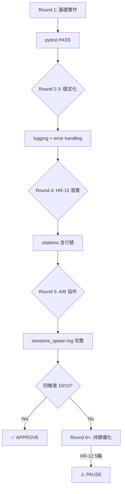

# Phase 5 執行計劃 — tts-kokoro-v613

> **版本**: 7.91
> **專案**: tts-kokoro-v613
> **日期**: 2026-04-14
> **Framework**: methodology-v2 7.91
> **狀態**: 待 Johnny 確認啟動

---

## 0. 執行協議（§0）

```
[Step 0] READ state.json → current_phase=5
[Step 1] LOAD SKILL.md §4 Phase 路由
[Step 2] CHECK 進入條件 → blocker → STOP
[Step 3] EXECUTE SOP → LAZY LOAD docs/P5_SOP.md
[Step 4] RECORD output | SPAWN A/B agent
[Step 5] CHECK 退出條件 → fail → FIX + RETRY
[Step 6] UPDATE state.json phase=6 → GOTO 1
```

**CLI 命令**：
```bash
python3 cli.py update-step --step N
python3 cli.py end-phase --phase 5
python3 cli.py stage-pass --phase 5
python3 cli.py run-phase --phase 5 --goal "Phase 5 execution"
```

---

## 1. 硬規則（HR-01~HR-15）

| HR | 規則 | 後果 | 具體行動 |
|----|------|------|---------|
| HR-01 | A/B 不同 Agent，禁自寫自審 | 終止 -25 | Developer spawn → Reviewer spawn（嚴格順序）|
| HR-02 | Quality Gate 需實際命令輸出 | 終止 -20 | 每個 QG 保存 stdout |
| HR-03 | Phase 順序執行，不可跳過 | 終止 -30 | state.json phase=5 |
| HR-04 | HybridWorkflow mode=ON，強制 A/B | 終止 | prompt 含 mode=ON |
| HR-05 | 衝突時優先 methodology-v2 | 記錄 | 爭議時 methodology-v2 為準 |
| HR-06 | 禁引入規格書外框架 | 終止 -20 | forbidden list |
| HR-07 | DEVELOPMENT_LOG 需記錄 session_id | -15 | 每筆記 session_id |
| HR-08 | Phase 結束需執行 Quality Gate | 終止 -10 | stage-pass --phase 5 |
| HR-09 | Claims Verifier 驗證需通過 | 終止 -20 | citations 對照 |
| HR-10 | sessions_spawn.log 需有 A/B 記錄 | 終止 -15 | 每 step 2 筆記錄 |
| HR-11 | Phase Truth < 70% 禁進入下一 Phase | 終止 | <70% → PAUSE |
| HR-12 | A/B 審查 > 5 輪 → PAUSE | — | 達 5 輪主動停 |
| HR-13 | Phase 執行 > 預估 ×3 → PAUSE | — | 記 start_time |
| HR-14 | Integrity < 40 → FREEZE | — | QG 後查 Integrity |
| HR-15 | citations 必須含行號 + artifact_verification | -15 | 無 citations = 任務失敗 |

---

## 2. A/B 協作（HR-01, HR-04）

### On Demand / Need to Know 原則

| 原則 | 定義 |
|------|------|
| **Need to Know** | 只給必要資訊，L1/NFR 被問時才提供 |
| **On Demand** | Sub-agent 自己讀 artifact paths，不 dump |
| **職責單一** | 每個 Sub-agent 只做一個 FR |

### HR 約束（Phase 5）
HR-01 | HR-04 | HR-08 | HR-10

### TH 閾值（Phase 5）
TH-02 | TH-07

### A/B 角色（Phase 5）

| 角色 | Agent | 職責 |
|------|-------|------|
| **Agent A** | `devops` | 主要實作 |
| **Agent B** | `architect` | 審查驗證 |

### TH 閾值詳細

| TH | 指標 | 門檻 | 驗證命令 |
|------|------|------|---------|
| TH-02 | Constitution 總分 | ≥80% | `constitution/runner.py --type verification` |
| TH-07 | 邏輯正確性分數 | ≥90 | `phase-verify` |
| TH-15 | Phase Truth | ≥70% | `phase-verify` |

---

## 3. FR-by-FR 任務表格（共 9 項）

*（此 Phase 不需要 FR table）*

---

## 3.5 上階段產出承接（Phase 5 前置產出）

> 上階段（Phase 4）產出摘要：

| 產出 | 狀態 | 路徑 |
|------|:-----:|------|
| ❌ 任務初始化 | ❌ | `TASK_INITIALIZATION_PROMPT.md` |
| ✅ 需求規格 | ✅ | `/Users/johnny/.openclaw/workspace/tts-kokoro-v613/SRS.md` (9 FR, 4 NFR) |
| ✅ 系統架構 | ✅ | `/Users/johnny/.openclaw/workspace/tts-kokoro-v613/02-architecture/SAD.md` (0 modules) |
| ✅ 架構決策 | ✅ | `/Users/johnny/.openclaw/workspace/tts-kokoro-v613/02-architecture/ADR.md` |
| ❌ 代碼實作 | ❌ | `app/` |
| ✅ 測試結果 | ✅ | `/Users/johnny/.openclaw/workspace/tts-kokoro-v613/04-testing/TEST_RESULTS.md` |

> ⚠️ 請在執行前確認上階段產出存在且完整。

---

## 4. 產出結構樹

```
03-development/src/
├── api/
│   ├── routes.py
├── backend/
│   ├── kokoro_client.py
├── infrastructure/
│   ├── audio_converter.py
│   ├── circuit_breaker.py
│   ├── redis_cache.py
├── processing/
│   ├── lexicon_mapper.py
│   ├── ssml_parser.py
│   ├── text_chunker.py
├── synth/
│   ├── synth_engine.py
tests/
├── test_fr01_*.py
├── test_fr02_*.py
├── test_fr03_*.py
├── test_fr04_*.py
├── test_fr05_*.py
... (4 more)
```

> 📋 結構從 SAD.md §1.3 FR 需求對應表解析

### 交付物檢查清單

```markdown
## Phase 5 交付物

### 代碼產出
- [ ] `03-development/src/processing/` - 處理模組
- [ ] `03-development/src/synth/` - 合成模組
- [ ] `03-development/src/infrastructure/` - 基礎設施模組（如有）
- [ ] `03-development/src/api/` - API 路由（如有）

### 測試產出
- [ ] `tests/test_fr01*.py` - FR-01 測試
- [ ] `tests/test_fr02*.py` - FR-02 測試
- [ ] ...（共 9 個 FR）

### 文檔產出
- [ ] `AB_COLLABORATION.md` - Developer+Reviewer 協作記錄
- [ ] `sessions_spawn.log` - A/B session 完整記錄
- [ ] `docs/TOOL_HOOK_LOG.md` - 工具鉤子使用記錄（可選）
- [ ] `docs/OPTIMIZATION_REPORT.md` - 四維度評核報告（可選）

### 驗證產出
- [ ] pytest 所有測試 PASS
- [ ] coverage ≥80%
- [ ] Phase Truth ≥70%

### Git 產出
- [ ] git push 完成
- [ ] remote 同步驗證
```

---

## 5. FR 詳細任務（共 9 項）

> ⚠️ FR 詳細任務需要解析 SRS.md §FR-XX
> 完整內容見 `.methodology/plans/phase5_FULL.md`
> 若要生成詳細任務，加上 `--detailed` flag


---


## Phase 5 任務：驗證交付

### Phase 5 概述
Phase 5 依據測試結果進行系統驗證，確保符合需求。

### 驗證項目
- [ ] 整合測試通過
- [ ] 效能測試達標
- [ ] 安全掃描通過
- [ ] Baseline 建立完成

### Phase 5 交付物
- [ ] `BASELINE.md` - 系統基線
- [ ] `MONITORING_PLAN.md` - 監控計畫
- [ ] `VERIFICATION_REPORT.md` - 驗證報告


## 6. 外部文檔

| 文檔 | 用途 |
|------|------|
| `SKILL_DOMAIN.md` | 領域知識 |
| `docs/P5_SOP.md` | Phase 5 詳細步驟 |
| `docs/BASELINE_TEMPLATE.md` | 基線模板 |
| `docs/MONITORING_PLAN_TEMPLATE.md` | 監控計畫模板 |
| `docs/VERIFICATION_GUIDE.md` | 驗證規範 |

---

## 7. Agent Prompt 模板

### Agent A（依 Phase 而定）
Agent A 的角色根據 Phase 決定：
- Phase 1: requirements
- Phase 2-3: architect/developer
- Phase 4: tester
- Phase 5: devops
- Phase 6: qa
- Phase 7: risk
- Phase 8: devops

### Agent B（依 Phase 而定）
Agent B 的角色根據 Phase 決定：
- Phase 1-2: architect/reviewer
- Phase 3: reviewer
- Phase 4: reviewer
- Phase 5-6: architect
- Phase 7: architect
- Phase 8: reviewer

詳細 prompts 見各 Phase 的產出文件。

```
```
TASK: 建立系統 Baseline + Monitoring Plan
TASK_ID: task-p5
═══════════════════════════════════════

【階段目標】
依據測試結果建立系統 Baseline，確保可監控、可追溯

【On Demand 讀取】（只讀這些章節，❌ 禁止 dump 全文）
- TEST_RESULTS.md（只讀通過/失敗統計）
- SRS.md（只讀效能需求和約束）

【產出】
- BASELINE.md：系統基線（效能基準、配置快照）
- MONITORING_PLAN.md：監控計畫（指標、警報閾值）
- VERIFICATION_REPORT.md：驗證報告

【驗證標準】
- Baseline 效能符合 SRS 約束
- Monitoring 覆蓋關鍵指標
- 警報閾值設定合理

【FORBIDDEN】
- ❌ Baseline 偏離實際效能
- ❌ 監控指標遺漏關鍵項目
- ❌ 警報閾值過寬或過嚴
- ❌ 無 citations 或無行號 → HR-15 違規

【OUTPUT_FORMAT】
{{
 "status": "success|error|unable_to_proceed",
 "result": "實際產出（BASELINE.md, MONITORING_PLAN.md 路徑）",
 "confidence": 1-10,
 "citations": ["TEST_RESULTS.md#L10-L20"],
 "summary": "50字內"
}}

HR-15 強制執行：citations 必須包含「檔名#L行號」格式
═══════════════════════════════════════
```
```

### Agent B（Reviewer）

```
```
TASK: Review 系統 Baseline + Monitoring Plan
TASK_ID: task-p5-review
═══════════════════════════════════════

【審查範圍】（只讀這些章節，❌ 禁止 dump 全文）
- BASELINE.md
- MONITORING_PLAN.md
- TEST_RESULTS.md（只讀統計）

【驗證檢查清單】
1. Baseline 效能符合 SRS 約束
2. Monitoring 覆蓋所有關鍵指標
3. 警報閾值合理（可達標且不會誤報）
4. 監控儀表板可追蹤
5. Constitution 驗證分數 ≥80%

【REJECT_IF】
- ❌ Baseline 不符合 SRS → REJECT
- ❌ 監控指標遺漏 → REJECT
- ❌ 警報閾值不合理 → REJECT
- ❌ 缺少 citations 或無行號 → REJECT（HR-15）

【OUTPUT_FORMAT】
{{
 "status": "APPROVE|REJECT",
 "confidence": 1-10,
 "violations": ["具體問題"],
 "summary": "50字內"
}}
═══════════════════════════════════════
```
```

```
═══════════════════════════════════════
TASK: FR-{FR_NUM} {MODULE_NAME}
TASK_ID: task-{FR_NUM_ZF}
═══════════════════════════════════════

PROMPT（自己讀）：
- SRS.md (§FR-{FR_NUM})
- 02-architecture/SAD.md (§Module 邊界對照表)

OUTPUT:
- {OUTPUT_FILE}
- {TEST_FILE}

FORBIDDEN:
- ❌ 03-development/src/infrastructure/（已廢除）
- ❌ 使用 @covers annotation → 請改用 docstring [FR-XX]
- ❌ @type: edge → positive/negative/boundary
- ❌ ... 省略 → 任務失敗
- ❌ **沒有執行 grep 確認行號就寫入 docstring**
- ❌ **沒有執行 grep 確認 Citations 寫入就返回 JSON**

【強制執行步驟 - Citations 驗證】

STEP 1: 讀取 SRS.md §FR-XX 和 SAD.md §對應章節

STEP 2: 用 grep 確認函數的實際行號：
```bash
grep -n "def 函數名\|class 類別名" 03-development/src/xxx.py
```
把輸出的行號記下來（不是估算）

STEP 3: 實作 + 寫 docstring 時用 STEP 2 的實際行號

STEP 4: 寫完後再次 grep 確認：
```bash
grep -A5 "def 函數名" 03-development/src/xxx.py | grep "Citations:"
```
確認 Citations 確實寫入且行號正確

STEP 5: 只通過 STEP 4 才能返回 JSON

OUTPUT_FORMAT:
{{
 "status": "success|error|unable_to_proceed",
 "result": "實際產出",
 "confidence": 1-10,
 "citations": ["FR-{FR_NUM}", "SAD.md#L23-L45"],
 "summary": "50字內"
}}
═══════════════════════════════════════
```

---

## 8. Iteration 修復流程

### 四維度評核標準（目標 10/10）

| 維度 | 目標 | 指標 | 評估方法 |
|------|------|------|---------|
| **規範符合度** | 10/10 | Baseline 符合 SRS 約束 | 效能數據對照 SRS |
| **A/B 協作** | 10/10 | sessions_spawn.log | developer + reviewer 各 1 筆記錄 |
| **子代理管理** | 10/10 | SubagentIsolator | fresh_messages 隔離 |
| **監控覆蓋** | 10/10 | 監控指標覆蓋 100% | MONITORING_PLAN.md 完整性 |

### 迭代策略（每個 FR）



### 每輪目標

### 每輪目標

| Round | 目標 | 交付物 |
|-------|------|--------|
| Round 1 | 效能基準 | BASELINE.md 效能基準 |
| Round 2 | 監控設置 | 監控指標定義 |
| Round 3 | 警報配置 | 警報閾值合理 |
| Round 4 | 驗證報告 | VERIFICATION_REPORT.md |
| Round 5 | 交付準備 | 交付檢查清單完成 |

### 終止條件

```
✅ 四維度全部 10/10 → APPROVE
⚠️ HR-12 5輪限制 → PAUSE（通知 Johnny）
⏰ HR-13 >3x 預估時間 → PAUSE（checkpoint）
```

### 四維度達標判定

| 維度 | 評估方法 | 目標 |
|------|---------|------|
| **規範符合度** | `grep -c '\[FR-' 03-development/src/**/*.py` | citations ≥ 每函數 1 個 |
| **A/B 協作** | `sessions_spawn.log` 記錄完整 | developer + reviewer 各 1 筆記錄 |
| **子代理管理** | `SubagentIsolator` 使用正確 | `fresh_messages` 隔離 |
| **測試覆蓋率** | `pytest --cov=03-development/src/ --cov-report=term` | ≥80% |

### 四維度評核命令

```bash
# 1. 規範符合度
grep -r "\[FR-" 03-development/src/ --include="*.py" | wc -l

# 2. A/B 協作
cat sessions_spawn.log | grep -c "developer\|reviewer"

# 3. 子代理管理
cat sessions_spawn.log | grep -c "spawn"

# 4. 測試覆蓋率
pytest --cov=03-development/src/ --cov-report=term -q
```

**HR-12（5輪限制）**：
- Round 1-4: 正常修復繼續
- Round 5: ⚠️ HR-12 PAUSE，通知 Johnny

---


## 9. 工具調用時機（On Demand 觸發）

| 工具 | 觸發時機 | 調用方式 |
|------|---------|---------|
| **SubagentIsolator** | 派遣 Sub-agent 前 | `si.spawn(role=AgentRole.DEVOPS, task="...")` |
| **PermissionGuard** | exec/rm 操作前 | `pg.check(Operation(type="exec", ...))` |
| **ContextManager** | context > 50 條訊息 | `cm.compress_if_needed()` |
| **SessionManager** | 任務 > 30 分鐘 | `sm.save("task-id", state)` |
| **KnowledgeCurator** | 派遣前驗證覆蓋率 | `kc.verify_coverage(fr_list=["FR-01"])` |
| **ToolRegistry** | 新工具引入時 | `tr.register("Tool", handler)` |

### On Demand 觸發條件

```
• SubagentIsolator → 每次派遣前（HR-01）
• PermissionGuard → exec/rm 前（安全檢查）
• ContextManager → context > 50 時自動壓縮
• SessionManager → 任務開始時 + 30 分鐘後自動 save
• KnowledgeCurator → Phase 開始前 verify
• ToolRegistry → 發現新工具時 register
```

## 9.5 Sub-Agent Management（Need-to-Know + On-Demand）

**Phase 5: 驗證交付**

### Agent 角色
- **Agent A（devops）**: 建立 Baseline + Monitoring
- **Agent B（architect）**: 審查 Baseline

### Need-to-Know（只給必要資訊）

| 檔案 | 章節 | 原因 |
|------|------|------|
| TEST_RESULTS.md | 通過/失敗統計 | 建立效能基準 |
| SRS.md | 效能需求和約束 | 確保 Baseline 符合要求 |

**Skip**: `Phase 6-8 產出, 詳細測試案例`
**Context**: single_phase

### On-Demand（需要時才請求）

- **觸發條件**: 當測試結果與 SRS 效能約束不符時
- **請求對象**: 回到 Phase 3/4 修正
- **格式**: 建立 Issue 追蹤

### 工具調用時機

| 事件 | 工具 | 參數 |
|------|------|------|
| spawn | 派遣 Sub-agent | {'role': 'devops'} |
| knowledge_curator | KnowledgeCurator | - |
| context_manager | ContextManager | - |
| quality_gate | Quality Gate | - |
| checkpoint | Checkpoint | - |

### 隔離方法

- **Method**: `SubagentIsolator.spawn`
- **Fresh Messages**: `（空）`
- **Log Format**: `{"timestamp","role","task","session_id","commit"}`


## 10. Quality Gate（Step 9）

### 依序執行，全部通過才能 APPROVE

```bash
# Phase-specific QG commands
# Add based on phase


```

---

## 10.5 自動化品質增強（v6.61+ 新功能）

### 當前 framework 版本支援的自動化功能

| 功能 | 版本 | 啟用方式 | 說明 |
|------|------|----------|------|
| **BVS** | v6.62 | 自動（Constitution runner）| 驗證 Agent 行為是否符合 Constitution |
| **HR-09 Claims Verifier** | v6.63 | 自動（Constitution runner）| 驗證 citations 是否有 artifact 支持 |
| **CQG** | v6.61 | `python cli.py quality-gate` | Linter + Complexity + Coverage 自動檢查 |
| **AutoResearch** | IMPROVEMENT_P1-3 | ⚠️ 獨立 Skill | 自動生成測試案例（作為獨立 Skill，等成熟再整合） |
| **Feedback Loop** | v6.29 | 自動（如果啟用）| 收集並回饋執行結果 |
| **Steering Loop** | v6.67 | `steering run --phase N` | 根據反饋自動調整策略 |
| **Self-Correction Engine** | v6.67 | 自動（如果啟用）| 根據錯誤自動修正代碼 |
| **Verify_Agent** | v6.21 | `cli.py verify-artifact --phase 5` | 第三方獨立審計（當 Agent B 超過 20 輪） |
| **SAB Drift Detection** | IMPROVEMENT_P0-3 | `python cli.py trace-check` 或 UnifiedGate | 驗證代碼↔SAD 一致性 |

### 建議的自動化流程（Phase 3+）

```bash
# 1. FR Execution Loop
for FR in FR-01 FR-02 ... FR-09; do
    # Agent A + Agent B 執行
    # Constitution Check（自動含 BVS + HR-09）
done

# 2. 自動化品質檢查
python cli.py quality-gate --phase 5

# 3. SAB Drift Detection（代碼↔SAD 一致性）
python cli.py trace-check --phase 5

# 4. AutoResearch 自動生成測試（獨立 Skill）
# 詳見：skills/auto_research/SKILL.md

# 5. Feedback Loop 收集回饋
steering run --phase 5

# 6. Verify_Agent（如需要）
if [ $AGENT_B_ROUNDS -gt 20 ]; then
    python cli.py verify-artifact --phase 5
fi
```

### SAB Drift Detection 說明

| 項目 | 內容 |
|------|------|
| **TH-16** | 代碼↔SAD 映射率 = 100% |
| **目的** | 驗證代碼結構與 SAD 設計一致 |
| **工具** | `sab_spec.py` + `trace-check` 命令 |
| **時機** | Phase 3 Constitution check 前執行 |

---

## 11. sessions_spawn.log 格式（HR-10）

每個 FR 產生 2 筆記錄，共 9 × 2 = 18 筆記錄：

```json
每 Phase 2 筆記錄（developer + reviewer）
```

---

## 12. Commit 格式

```
[Phase 5] Step {N}: FR-{FR_NUM} {MODULE_NAME} (HASH)
```

範例：
```
[Phase 5] Step 1: FR-01 {MODULE_NAME} (a1b2c3d)
[Phase 5] Step 2: FR-02 {MODULE_NAME} (e4f5g6h)
...
```

---

## 13. 估計時間

| 階段 | 估計時間 |
|------|---------|
| Pre-execution | 10 分鐘 |
| FR-01 ~ FR-9（各 15-20 分鐘） | 120-160 分鐘 |
| Quality Gate | 30 分鐘 |
| **總計** | **約 3-3.5 小時** |

---

## 14. Phase Truth 組成

```
✅ FrameworkEnforcer BLOCK (權重 40%)
✅ Sessions_spawn.log (權重 20%)
✅ pytest 實際通過 (權重 20%)
✅ 測試覆蓋率達標 (權重 20%)
```

---

## 15. 工具速查

### SubagentIsolator
```python
from subagent_isolator import SubagentIsolator, AgentRole
si = SubagentIsolator()
result = si.spawn(role=AgentRole.DEVELOPER, task="FR-{FR_NUM}", artifact_paths=["SRS.md"])
```

### PermissionGuard
```python
from permission_guard import PermissionGuard
pg = PermissionGuard()
pg.check(Operation(type="exec", permission="EXEC_BASH", target="rm -rf /tmp"))
```

### KnowledgeCurator
```python
from knowledge_curator import KnowledgeCurator
kc = KnowledgeCurator()
kc.verify_coverage(fr_list=["FR-01", "FR-02"])
```

### ContextManager（三層壓縮）
```python
from context_manager import ContextManager
cm = ContextManager()
cm.compress_if_needed()  # L1>50, L2>100, L3>200
```

### SessionManager
```python
from checkpoint_manager import SessionManager
sm = SessionManager()
sm.save("fr{FN}-impl", state_dict)
```

### ToolRegistry
```python
from tool_registry import ToolRegistry
tr = ToolRegistry()
tr.register("NewTool", handler)
```

---

## 16. Pre-Execution Checklist

```
□ state.json 已初始化（phase=5, step=0）
□ sessions_spawn.log 已清空重建
□ KnowledgeCurator.verify_coverage() 已執行
□ ContextManager.create_task() 已執行（9 個 task）
□ Artifact paths 已確認
□ Forbidden 事項已定義
□ 產出格式已定義
□ sessions_spawn.log 已寫入第一筆記錄（spawn 前）
□ state.json 已更新
□ 長期任務已 session-save（如超過 30 分鐘）
□ 新工具已 ToolRegistry.register（如有引入）
□ DEVELOPMENT_LOG 已更新（Phase 5 開始）
```

---

## 17. Agent 執行流程（v7.25+ 含增強功能）

### ⚠️ 重要：sessions_spawn 由 Agent 直接呼叫

`sessions_spawn` 是 OpenClaw runtime tool，**不是 Python module**。
cli.py 無法 import，但 **Agent 可以直接呼叫**。

### 增強功能整合（Section 10.5）

| 功能 | 整合時機 | 呼叫方式 |
|------|---------|---------|
| **BVS** | 每個 FR 審查後 | `constitution/runner.py --type implementation` |
| **HR-09 Claims Verifier** | 每個 FR 審查後 | `constitution/runner.py --type implementation`（自動）|
| **check_fr_full.py** | 每個 FR APPROVE 後 | `check_fr_full.py --fr {fr_id} --project /path --loop` |
| **CQG** | 每個 FR APPROVE 後 | `cli.py quality-gate --phase 5` |
| **SAB Drift Detection** | POST-FLIGHT | `cli.py trace-check --phase 5` |
| **Steering Loop** | POST-FLIGHT | `cli.py steering run --phase 5` |
| **Phase Truth** | POST-FLIGHT | `cli.py phase-verify --phase 5` |
| **AutoResearch** | POST-FLIGHT | `cli.py auto-research --project /path --phase 5` |

### Agent 執行 Workflow（含增強）

```
┌─────────────────────────────────────────────────────────────┐
│ Agent: python cli.py run-phase --phase 5            │
│   → PRE-FLIGHT (FSM, Constitution, Tool Registry)           │
└─────────────────────────────────────────────────────────────┘
                              ↓
┌─────────────────────────────────────────────────────────────┐
│  FR 執行迴圈 (FR-01 ~ FR-9)                     │
│                                                            │
│  ┌─────────────────────────────────────────────────────┐ │
│  │ 1. Developer 實作 → sessions_spawn(dev)             │ │
│  │ 2. 解析 JSON → 寫入檔案                              │ │
│  │ 3. Reviewer 審查 → sessions_spawn(rev)               │ │
│  │ 4. ✅ Constitution Check（含 BVS + HR-09）          │ │
│  │ 5. ✅ CQG（Linter + Complexity + Coverage）          │ │
│  │ 6. HR-12 檢查 → ≥5輪 PAUSE                          │ │
│  └─────────────────────────────────────────────────────┘ │
└─────────────────────────────────────────────────────────────┘
                              ↓
┌─────────────────────────────────────────────────────────────┐
│ POST-FLIGHT                                                │
│   1. ✅ SAB Drift Detection（代碼↔SAD）                   │
│   2. ✅ Steering Loop（如啟用）                            │
│   3. ✅ Phase Truth 驗證（≥70%）                          │
│   4. ✅ AutoResearch 品質改進（Phase-aware scoring）     │
│   5. ✅ stage-pass + enforce BLOCK                        │
└─────────────────────────────────────────────────────────────┘
```

### 完整 Agent 執行腳本（含增強功能）

```python
#!/usr/bin/env python3
"""
Phase 5 FR 執行腳本（含 Section 10.5 增強功能）
版本: v7.25+
"""

import subprocess
import json
from pathlib import Path

PROJECT_PATH = Path("/path/to/project")
PHASE = 5
FR_LIST = ["FR-01", "FR-02", ..., "FR-9"]

def run_cmd(cmd: list, cwd: Path = PROJECT_PATH) -> subprocess.CompletedProcess:
    """執行 CLI 命令並返回結果"""
    print(f"   $ {' '.join(cmd)}")
    result = subprocess.run(cmd, cwd=cwd, capture_output=True, text=True)
    return result

# ==========================================
# PRE-FLIGHT
# ==========================================
print("🚀 PRE-FLIGHT")
run_cmd(["python3", "cli.py", "run-phase", "--phase", str(PHASE)])

# ==========================================
# FR 執行迴圈
# ==========================================
for fr_id in FR_LIST:
    print(f"\n{'='*60}")
    print(f"📦 執行 {fr_id}")
    print(f"{'='*60}")
    
    iteration = 1
    max_iterations = 5
    
    while iteration <= max_iterations:
        print(f"\n🔄 {fr_id} Iteration {iteration}/{max_iterations}")
        
        # 1. Developer 實作
        print(f"\n👨💻 [Developer] 實作 {fr_id}")
        
        dev_task = f"""你是 Developer Agent，實作 {fr_id}

任務：
1. 讀取 SRS.md (§{fr_id}) 和 SAD.md
2. 實現代碼（使用 03-development/src/ 路徑）
3. 返回 JSON：

{{
  "status": "success",
  "files": [
    {{
      "path": "03-development/src/.../{fr_id.lower()}.py",
      "content": "# 完整代碼..."
    }}
  ],
  "confidence": 1-10,
  "citations": ["{fr_id}", "SRS.md#L23"],
  "summary": "實作摘要"
}}

【FORBIDDEN】
- ❌ app/infrastructure/（已廢除）
- ❌ docstring 無 [FR-XX]
- ❌ docstring 無 Citations（含行號）
"""
        
        dev_result = sessions_spawn(task=dev_task, mode="run", runtime="subagent")
        
        # 2. 解析 JSON 並寫入檔案
        print(f"\n📁 寫入檔案...")
        try:
            result_text = dev_result.get("result", "{}").strip()
            if result_text.startswith('[SKILL]'):
                result_text = result_text[6:].strip()
            import re
            match = re.search(r'```(?:json)?\s*([\s\S]*?)```', result_text)
            if match:
                result_text = match.group(1).strip()
            dev_data = json.loads(result_text)
            for f in dev_data.get("files", []):
                file_path = PROJECT_PATH / f["path"]
                file_path.parent.mkdir(parents=True, exist_ok=True)
                file_path.write_text(f["content"])
                print(f"   ✅ {f['path']}")
        except Exception as e:
            print(f"   ❌ 檔案寫入失敗: {e}")
        
        # 3. Reviewer 審查
        print(f"\n🔍 [Reviewer] 審查 {fr_id}")
        
        rev_task = f"""你是 Reviewer Agent，審查 {fr_id}

任務：
1. 讀取代碼檔案
2. 對照 SRS.md (§{fr_id}) 和 SAD.md
3. 返回 JSON：

{{
  "status": "success",
  "review_status": "APPROVE" 或 "REJECT",
  "reason": "審查理由",
  "confidence": 1-10,
  "citations": ["{fr_id}", "SAD.md#L45"],
  "summary": "審查摘要"
}}

【REJECT_IF】
- ❌ docstring 無 [FR-XX] 標記 → REJECT
- ❌ docstring 無 Citations（含行號）→ REJECT
- ❌ 缺少 citations 或 citations 無行號 → REJECT（HR-15）
"""
        
        rev_result = sessions_spawn(task=rev_task, mode="run", runtime="subagent")
        
        # 4. Constitution Check（含 BVS + HR-09）
        print(f"\n⚖️ [BVS + HR-09] Constitution Check")
        result = run_cmd(["python3", "quality_gate/constitution/runner.py", "--type", "implementation"])
        print(f"   {'✅' if result.returncode == 0 else '⚠️'} Constitution {'PASS' if result.returncode == 0 else '警告'}")
        
        # 5. CQG（Linter + Complexity + Coverage）
        print(f"\n🔬 [CQG] Quality Gate Check")
        result = run_cmd(["python3", "cli.py", "quality-gate", "--phase", str(PHASE)])
        print(f"   {'✅' if result.returncode == 0 else '⚠️'} CQG {'PASS' if result.returncode == 0 else '警告'}")
        
        # 6. 迭代判斷
        review_status = rev_result.get("review_status", None)
        if review_status == "APPROVE":
            print(f"\n✅ {fr_id} APPROVE")
            
            # Layer 1-3 檢查
            print(f"\n🔍 [Layer 1-3] FR Quality Check")
            METHODOLOGY_V2 = Path("/path/to/methodology-v2")
            result = run_cmd([
                "python3", 
                str(METHODOLOGY_V2 / "scripts" / "check_fr_full.py"),
                "--fr", fr_id,
                "--project", str(PROJECT_PATH),
                "--loop"
            ])
            print(f"   {'✅' if result.returncode == 0 else '⚠️'} Layer 1-3 Check {'PASS' if result.returncode == 0 else '需修復'}")
            
            break
        else:
            print(f"\n🔄 {fr_id} REJECT → 重新實作")
            iteration += 1
            if iteration > max_iterations:
                print(f"\n⚠️ HR-12 TRIGGERED: > {max_iterations} 輪 → PAUSE")
                break

# ==========================================
# POST-FLIGHT
# ==========================================
print(f"\n{'='*60}")
print("🚀 POST-FLIGHT")
print(f"{'='*60}")

print(f"\n🔍 [SAB Drift] 代碼↔SAD 一致性檢查")
result = run_cmd(["python3", "cli.py", "trace-check", "--phase", str(PHASE)])
print(f"   {'✅' if result.returncode == 0 else '⚠️'} SAB Drift {'PASS' if result.returncode == 0 else '警告'}")

print(f"\n🧭 [Steering] Steering Loop")
result = run_cmd(["python3", "cli.py", "steering", "run", "--phase", str(PHASE)])
print(f"   {'✅' if result.returncode == 0 else 'ℹ️'} Steering {'完成' if result.returncode == 0 else '未啟用'}")

print(f"\n📊 [Phase Truth] Phase Truth 驗證")
result = run_cmd(["python3", "cli.py", "phase-verify", "--phase", str(PHASE)])
print(f"   {'✅' if result.returncode == 0 else '❌'} Phase Truth {'≥70%' if result.returncode == 0 else '<70% → PAUSE'}")

print(f"\n🔬 [AutoResearch] Phase-aware 品質改進 (5)")
result = run_cmd(["python3", "cli.py", "auto-research", "--project", str(REPO), "--phase", str(PHASE)])
print(f"   {'✅' if result.returncode == 0 else '⚠️'} AutoResearch {'完成' if result.returncode == 0 else '略過'}")

print(f"\n✅ [STAGE_PASS] 執行 stage-pass")
run_cmd(["python3", "cli.py", "stage-pass", "--phase", str(PHASE)])

print(f"\n✅ Phase 5 完成！")
```

### PhaseHooks + 增強功能 呼叫時機

| 時機 | 呼叫 | 用途 |
|------|------|------|
| PRE-FLIGHT | `cli.py run-phase --phase 5` | FSM + Constitution |
| Dev 執行後 | `sessions_spawn(dev)` | 實作代碼 |
| Rev 執行後 | `sessions_spawn(rev)` | 審查代碼 |
| **Constitution** | `runner.py --type implementation` | **BVS + HR-09** |
| **CQG** | `cli.py quality-gate` | **Linter + Complexity** |
| HR-12 | `monitoring_hr12_check()` | ≥5輪 PAUSE |
| **SAB Drift** | `cli.py trace-check` | **代碼↔SAD** |
| **Steering** | `cli.py steering run` | **Workflow 控制** |
| **Phase Truth** | `cli.py phase-verify` | **≥70% 驗證** |
| **AutoResearch** | `cli.py auto-research` | **Phase-aware 品質改進** |
| POST-FLIGHT | `cli.py run-phase --resume` | Final State |

### sessions_spawn 呼叫方式

```python
sessions_spawn(
    task="你是 Developer Agent...",
    mode="run",
    runtime="subagent",
    timeout=300,
)
```

### Developer 返回格式

```json
{
  "status": "success",
  "files": [
    {
      "path": "03-development/src/processing/lexicon_mapper.py",
      "content": "# 完整代碼..."
    }
  ],
  "confidence": 8,
  "citations": ["FR-01", "SRS.md#L23-L45"],
  "summary": "FR-01 LexiconMapper 實作完成"
}
```

### Reviewer 返回格式

```json
{
  "status": "success",
  "review_status": "APPROVE",
  "reason": "代碼符合 SRS §FR-01 規格",
  "confidence": 9,
  "citations": ["FR-01", "SAD.md#L45-L60"],
  "summary": "審查通過，無違規"
}


---

## 18. 下一步

```bash
# Johnny 審核後，執行：
python3 cli.py run-phase --phase 5 --goal "Phase 5 execution"

# 或修復特定步驟：
python3 cli.py plan-phase --phase 5 --repair --step 5.2 --goal "Phase 5 execution"

# 生成完整 FR 詳細任務（需要 SRS.md）：
python3 scripts/generate_full_plan.py --phase 5 --repo /path/to/project
```

---

*本計劃依 SKILL.md 7.91 + P5_SOP.md 7.91 生成*
